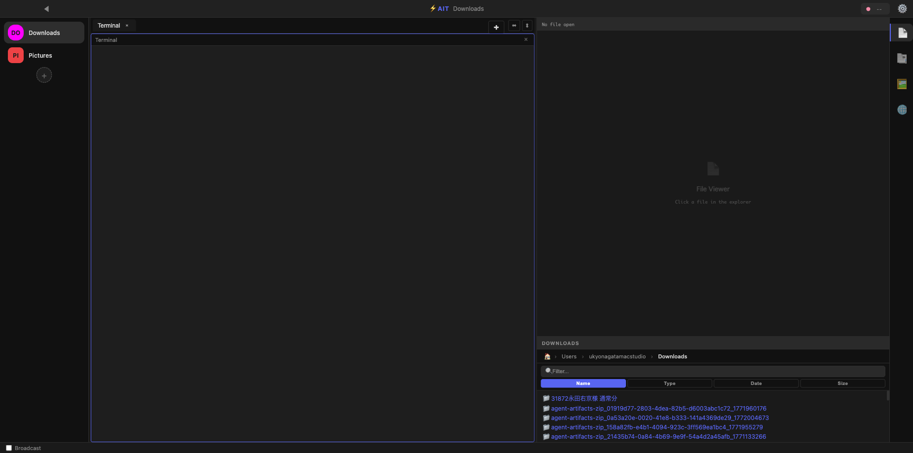
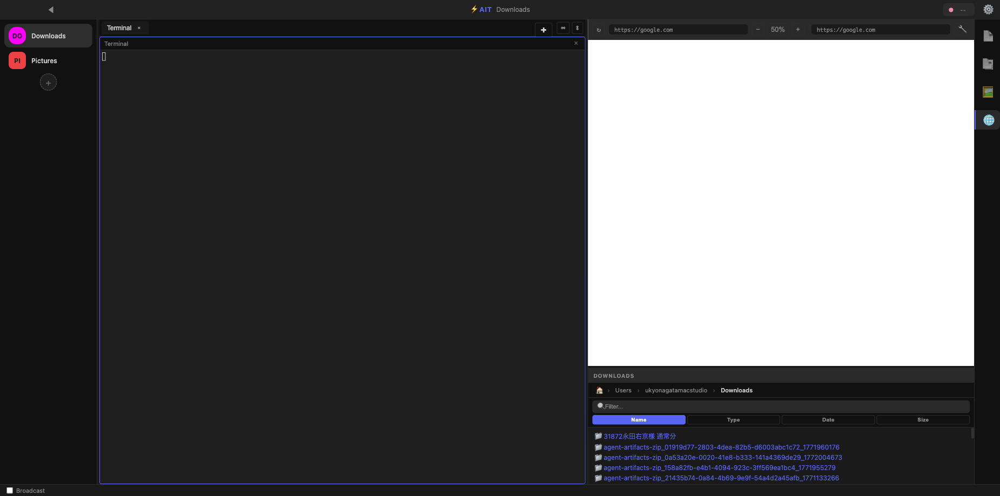

# AI Terminal IDE

[](https://opensource.org/licenses/MIT)
[](https://www.apple.com/macos)

---

## English

### Overview

**AI Terminal IDE** is a terminal-first IDE designed for developers who use agentic coding tools (OpenCode, Claude Code CLI) for intellectual production. It provides a stress-free, terminal-focused coding environment with the ability to continue work remotely from external devices.



### Key Features

- **Terminal-First Design**: Built on `xterm.js` and `node-pty` for native terminal experience
- **Multi-Project Management**: Slack-like workspace bar for switching between projects instantly
- **Remote Access**: Web mode allows controlling the IDE from external devices via browser
- **Broadcast Mode**: Send keystrokes to all workspace terminals simultaneously
- **Integrated File Explorer**: Browse and preview files directly in the IDE
- **Built-in Browser Panel**: Embedded webview for documentation/research without leaving the IDE
- **Theme Support**: Multiple themes including Dark, Tokyo Night, Light, Solarized

### UI Layout



1. **Left Workspace Bar**: Switch between projects instantly
2. **Central Terminal**: Primary interactive area with tab-based interface
3. **Bottom Broadcast Bar**: Mirror keystrokes across all terminals
4. **Right Panel**: File explorer, image viewer, PDF viewer, and browser

### Installation

#### Download DMG (Recommended)

Download the latest DMG installer from [Releases](https://github.com/ukyonagata0105/AIT/releases).

#### Build from Source

```bash
# Clone the repository
git clone https://github.com/ukyonagata0105/AIT.git
cd AIT/electron-shell

# Install dependencies
npm install

# Build the app
npm run build

# Start the application
npm run start
```

### Development

```bash
# Development mode with hot reload
npm run dev

# Run tests
npm test
```

### Remote Access (Web Mode)

Start the IDE with web mode to enable remote access:

```bash
npm run start:web
```

Then access from any browser: `http://YOUR_IP:4096`

---

## 日本語

### 概要

**AI Terminal IDE** は、エージェンティックコーディング（OpenCode、Claude Code CLI）を活用した知的生産を行う開発者のために設計されたターミナルファーストのIDEです。ストレスなくターミナルに集中したコーディングを行いながら、外部からもホストマシンを操作して作業を継続できる仕組みを提供します。


### 主な機能

- **ターミナルファーストデザイン**: `xterm.js` と `node-pty` によるネイティブなターミナル体験
- **マルチプロジェクト管理**: Slackライクなワークスペースバーでプロジェクト間を瞬時に切り替え
- **リモートアクセス**: ブラウザ経由で外部デバイスからIDEを操作可能なWebモード
- **ブロードキャストモード**: 全ワークスペースのターミナルに同時にキーストロークを送信
- **統合ファイルエクスプローラー**: IDE内でファイルをブラウズ・プレビュー
- **内蔵ブラウザパネル**: IDEを離れずにドキュメントやリサーチが可能
- **テーマ対応**: ダーク、Tokyo Night、ライト、Solarized など複数のテーマをサポート

### UIレイアウト


1. **左ワークスペースバー**: プロジェクト間を瞬時に切り替え
2. **中央ターミナル**: タブベースのメイン操作エリア
3. **下部ブロードキャストバー**: 全ターミナルにキーストロークを同期
4. **右パネル**: ファイルエクスプローラー、画像ビューア、PDFビューア、ブラウザ

### インストール

#### DMGからインストール（推奨）

[Releases](https://github.com/ukyonagata0105/AIT/releases) から最新のDMGインストーラーをダウンロードしてください。

#### ソースからビルド

```bash
# リポジトリをクローン
git clone https://github.com/ukyonagata0105/AIT.git
cd AIT/electron-shell

# 依存関係をインストール
npm install

# ビルド
npm run build

# 起動
npm run start
```

### 開発

```bash
# ホットリロード付き開発モード
npm run dev

# テスト実行
npm test
```

### リモートアクセス（Webモード）

Webモードで起動するとリモートアクセスが有効になります：

```bash
npm run start:web
```

任意のブラウザからアクセス: `http://YOUR_IP:4096`

---

## Tech Stack

- **Electron** - Cross-platform desktop apps
- **xterm.js** - Terminal emulator component
- **node-pty** - Pseudo terminal for Node.js
- **esbuild** - Fast bundler
- **TypeScript** - Type-safe JavaScript

## License

MIT License - see [LICENSE](LICENSE) for details.

## Contributing

Contributions are welcome! Please feel free to submit a Pull Request.
