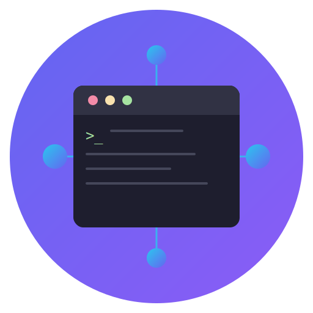

<p align="center">
  
</p>

<h1 align="center">TermNexus</h1>

<p align="center">
  <strong>for CLI LLM Coding Agents</strong>
</p>

<p align="center">
  A friendly terminal for everyone
</p>

<p align="center">
  <a href="https://github.com/ukyonagata0105/AIT/blob/main/LICENSE"></a>
  <a href="https://github.com/ukyonagata0105/AIT/releases"></a>
</p>

<p align="center">
  <a href="#english">English</a> | <a href="#日本語">日本語</a>
</p>

---

## English

TermNexus is a friendly terminal app for people who are new to the command line. Whether you're using AI coding assistants like Claude Code or OpenCode, managing projects with git, or just need to run occasional terminal commands — TermNexus makes it easy and stress-free.

**Perfect for:**
- Non-developers who occasionally use terminal commands
- People using AI coding assistants (Claude Code, OpenCode, Cursor)
- Anyone who wants a visual, approachable terminal experience
- Teams who need remote access to their terminal from other devices

### Features

- **Easy Project Switching** — Slack-like sidebar to switch between folders instantly
- **Built-in File Browser** — Preview files without leaving the app
- **Remote Access** — Control your terminal from a browser on another device
- **Broadcast Mode** — Run the same command across multiple projects at once
- **Dark & Light Themes** — Easy on the eyes, including Tokyo Night and Solarized
- **Integrated Browser** — Look up documentation without switching apps

### Installation

#### Download (Recommended)

Download the latest DMG installer from [Releases](https://github.com/ukyonagata0105/AIT/releases).

#### Build from Source

```bash
# Clone the repository
git clone https://github.com/ukyonagata0105/AIT.git
cd AIT/electron-shell

# Install dependencies
npm install

# Build and run
npm run build && npm run start
```

### Development

```bash
npm run dev      # Development mode with hot reload
npm test         # Run tests
```

### Remote Access

Start with web mode to enable remote access:

```bash
npm run start:web
```

Then access from any browser: `http://YOUR_IP:4096`

---

## 日本語

TermNexusは、ターミナルを少し触ったことがある人向けの、親しみやすいターミナルアプリです。Claude CodeやOpenCodeなどのAIコーディングアシスタントを使う方、gitでプロジェクト管理をする方、たまにコマンドを叩く方など — TermNexusならストレスなく簡単に使えます。

**こんな方におすすめ:**
- たまにターミナルを使う非エンジニアの方
- AIコーディングアシスタントを使う方（Claude Code、OpenCode、Cursor）
- 視覚的で使いやすいターミナルを求めている方
- 外出先からターミナルにアクセスしたい方

### 機能

- **簡単プロジェクト切替** — Slackライクなサイドバーでフォルダを瞬時に切り替え
- **内蔵ファイルブラウザ** — アプリ内でファイルをプレビュー
- **リモートアクセス** — 別デバイスのブラウザからターミナルを操作
- **ブロードキャストモード** — 複数プロジェクトに同じコマンドを一括実行
- **ダーク・ライトテーマ** — Tokyo Night、Solarizedなど目に優しいテーマ
- **内蔵ブラウザ** — アプリを切り替えずにドキュメントを確認

### インストール

#### ダウンロード（推奨）

[Releases](https://github.com/ukyonagata0105/AIT/releases) から最新のDMGインストーラーをダウンロードしてください。

#### ソースからビルド

```bash
# リポジトリをクローン
git clone https://github.com/ukyonagata0105/AIT.git
cd AIT/electron-shell

# 依存関係をインストール
npm install

# ビルドして起動
npm run build && npm run start
```

### 開発

```bash
npm run dev      # ホットリロード付き開発モード
npm test         # テスト実行
```

### リモートアクセス

Webモードで起動するとリモートアクセスが有効になります：

```bash
npm run start:web
```

任意のブラウザからアクセス: `http://YOUR_IP:4096`

---

## Tech Stack

| Technology | Description |
|------------|-------------|
| Electron | Cross-platform desktop apps |
| xterm.js | Terminal emulator component |
| node-pty | Pseudo terminal for Node.js |
| esbuild | Fast bundler |
| TypeScript | Type-safe JavaScript |

## License

[MIT](LICENSE)

## Contributing

Contributions are welcome! Please feel free to submit a Pull Request.

